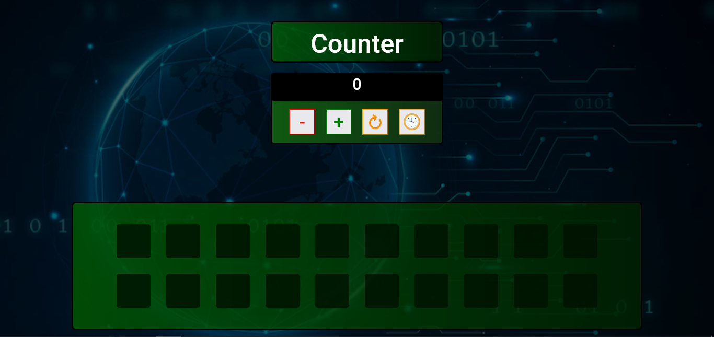

# Project counter
JavaScript Basics final project for Start2impact
## Description
This is a simple counter I made for the start2impact basic javascript project. In addition to decreasing, increasing or resetting its value, you can also save it in a counter for a total of 20 times. If you want to try it [click here](https://giovannivalastro.github.io/counter/).

## Built With
* HTML
* CSS
* Javascript
## Author
For more information visit [my website](https://giovannivalastro.github.io/)
## LICENSE
Distributed under the MIT License. See LICENSE.txt for more information.
